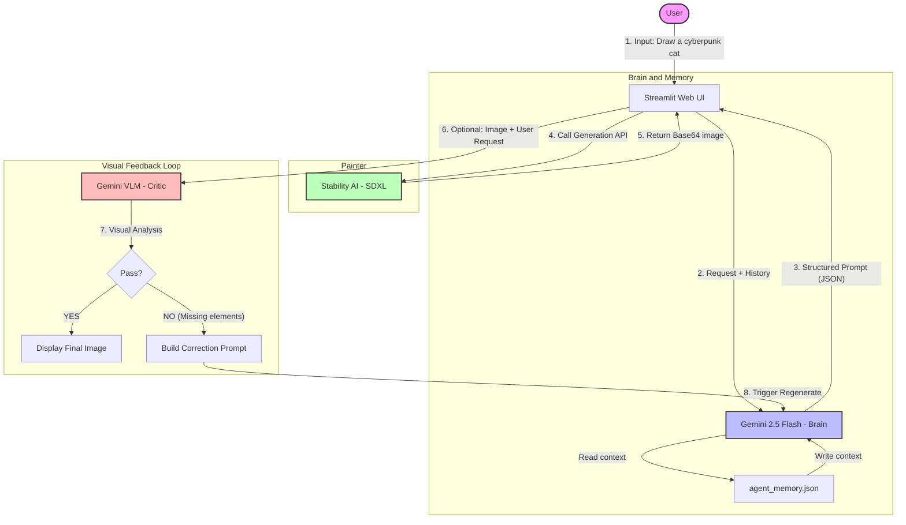

# 🎨 AI Art Director - Intelligent Art Pipeline

This is an end-to-end Intelligent Art Agent built on **Google Gemini (Brain/VLM)** and **Stability AI (SDXL)**. It goes beyond simple text-to-image generation, acting as a creative system with **long/short-term memory**, **context awareness**, and **visual self-correction** capabilities.

---

## System Architecture

The system follows a modular design consisting of three core roles: The Brain (Prompt Engineer), The Painter (Rendering Engine), and The Critic (Quality Assurance), all orchestrated via a Streamlit frontend.



---

## Core Features

**Senior Prompt Engineer:**
- Converts vague natural language (e.g., "draw a cat") into high-quality, SDXL-optimized English prompts (including lighting, composition, texture).
- Outputs structured JSON containing both Positive & Negative prompts.

**Context Awareness:**
- Supports multi-turn conversations. If the user says "make it red" or "add a hat," the Agent modifies the previous image concept rather than generating something unrelated.
- Uses a local JSON file (`agent_memory.json`) for persistence with a FIFO (First-In-First-Out) mechanism to manage context window limits.

**Visual Feedback Loop:**
- **Auto-Correction:** After generating an image, the Agent calls a Multimodal Model (Gemini VLM) to "look" at the result.
- If key elements are missing (e.g., user asked for an umbrella but the image has none), the system automatically triggers a fix and regeneration cycle without user intervention.

**Modern Web Interface:**
- Built with Streamlit for real-time interaction.
- Visualizes the Agent's "thought process" by displaying the optimized JSON prompts.

---

## File Structure

```
.
├── app.py              # Frontend entry point (Streamlit UI & Logic orchestration)
├── pipeline.py         # Backend logic (Prompt optimization, Memory, SDXL API)
├── vlm_feedback.py     # Visual feedback module (VLM analysis & QA)
├── config.yaml         # Configuration (API Keys, Model settings)
├── requirements.txt    # Python dependencies
├── agent_memory.json   # (Auto-generated) Conversation history storage
└── README.md           # Documentation
```

---

## How to Run the Pipeline

### 1. Prerequisites

Ensure you have Python 3.8+ installed. Using a conda environment is recommended to avoid conflicts.

```bash
conda create -n ai-art-director python=3.10
conda activate ai-art-director

pip install -r requirements.txt
```

### 2. Configuration Setup

You must create a `config.yaml` file in the project root directory. This file holds your sensitive API keys and model settings.

Create a file named `config.yaml` with the following content:

```yaml
api_keys:
  google: "YOUR_GEMINI_API_KEY"       # aistudio.google.com
  stability: "YOUR_STABILITY_API_KEY" # platform.stability.ai

models:
  brain: "gemini-2.5-flash"
  painter: "stable-diffusion-xl-1024-v1-0"

visual_feedback:
  enabled: true
  vlm_model: "gemini-2.5-flash"

memory:
  enabled: true
  file_path: "agent_memory.json"
  max_history_depth: 10
```

### 3. Start the Application

Run the Streamlit application from your terminal:

```bash
streamlit run app.py
```

The terminal will show a local URL (usually `http://localhost:8501`).

Your browser should open this URL automatically.

**To Stop:** Press `Ctrl+C` in your terminal.

---

## 💡 Usage Guide

**Scenario 1: Creation from Scratch**

- **User:** "Draw a cyberpunk cat eating ramen in the rain."
- **Agent:** (Thinking...) Generates detailed Prompt: "Cyberpunk cat eating ramen, neon rain, volumetric lighting, chrome fur texture..." → Calls SDXL.

**Scenario 2: Contextual Modification**

- **User:** "Change the ramen to a burger."
- **Agent:** (Reads Memory) Keeps the cyberpunk cat and rain background, only changes the action to eating a burger → Regenerates.

**Scenario 3: Visual Correction (Auto-Triggered)**

- **User:** "Draw a red balloon."
- **SDXL:** (Generates a blue balloon - Error)
- **Critic (VLM):** "Detected balloon color is blue, user requested red." → Fail.
- **Agent:** (Auto-Fix) "System Alert: Color mismatch. Regenerating with strong emphasis on RED balloon." → Regenerates correct image.

---

## ⚠️ Notes

- **API Costs:** This project consumes Google Gemini API (Free tier available) and Stability AI API (Paid/Credits). Please monitor your usage.
- **Local Storage:** Conversation history is stored in `agent_memory.json`. The agent will remember context even if you restart the app. Use the "Clear Memory" button in the sidebar to reset.
